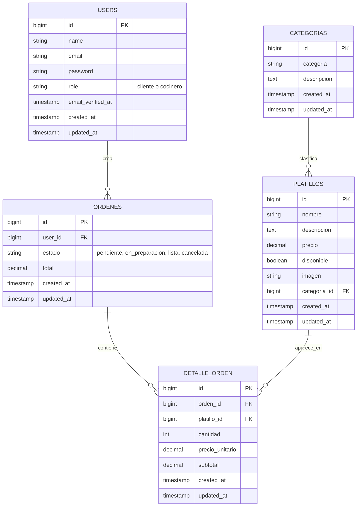

# Dream Garden Polanco - Sistema Web de Ordenes

Aplicacion web en Laravel + MySQL para Dream Garden Polanco. Los clientes crean ordenes desde el navegador y el personal de barra/cocina las gestiona por estado.

## Funcionalidades

- Registro e inicio de sesion con Laravel Breeze.
- Roles de usuario: `cliente` y `cocinero`.
- Middleware `role` para separar rutas y vistas por rol.
- Cliente:
  - Ve la carta disponible: bebidas, promociones, botellas, comida y extras.
  - Agrega productos al carrito con cantidades.
  - Crea ordenes con calculo automatico de subtotal y total.
  - Consulta su historial.
  - Cancela ordenes solo si siguen `pendiente`.
- Cocinero:
  - Ve todas las ordenes en un tablero FIFO.
  - Filtra por estado.
  - Ve contador de pendientes.
  - Cambia estados: `pendiente` -> `en_preparacion` -> `lista`.
  - Cancela ordenes pendientes.
  - Administra CRUD de productos, imagenes y disponibilidad.
- Recarga automatica del panel de cocina cada 10 segundos.
- Colores por estado: amarillo pendiente, azul preparacion, verde lista, rojo cancelada.

## Base de datos

Tablas principales, sin contar `users`:

- `categorias`: `id`, `categoria`, `descripcion`.
- `platillos`: `id`, `nombre`, `descripcion`, `precio`, `disponible`, `imagen`, `categoria_id`. Aunque la tabla se llama `platillos`, se usa para todos los productos de la carta.
- `ordenes`: `id`, `user_id`, `estado`, `total`.
- `detalle_orden`: `id`, `orden_id`, `platillo_id`, `cantidad`, `precio_unitario`, `subtotal`.

Relaciones implementadas:

- `User` tiene muchas `Orden`.
- `Orden` pertenece a `User` y tiene muchos `DetalleOrden`.
- `DetalleOrden` pertenece a `Orden` y a `Platillo`.
- `Platillo` pertenece a `Categoria` y tiene muchos `DetalleOrden`.
- `Categoria` tiene muchos `Platillo`.

Arquitectura de la base de datos:



## Instalacion en otra laptop

Requisitos:

- PHP 8.2 o superior.
- Composer.
- Node.js y npm.
- MySQL o MariaDB.

Pasos:

```bash
git clone <url-del-repositorio>
cd Proyecto_Restaurante
composer install
npm install
cp .env.example .env
php artisan key:generate
```

Si no tienes Composer global pero si tienes PHP, puedes usar el archivo incluido:

```bash
php composer.phar install
```

Crea una base de datos en MySQL:

```sql
CREATE DATABASE restaurante_ordenes CHARACTER SET utf8mb4 COLLATE utf8mb4_unicode_ci;
```

Edita `.env` con tus datos de MySQL:

```env
DB_CONNECTION=mysql
DB_HOST=127.0.0.1
DB_PORT=3306
DB_DATABASE=restaurante_ordenes
DB_USERNAME=root
DB_PASSWORD=
```

Ejecuta migraciones y datos de prueba:

```bash
php artisan migrate:fresh --seed
npm run build
php artisan serve
```

Si ya tenias el proyecto instalado y solo jalaste estos cambios, corre:

```bash
php artisan migrate
```

Ese comando agrega la columna nueva `imagen` sin borrar tus datos.

Abre:

```text
http://127.0.0.1:8000
```

Para desarrollo con Vite en vivo:

```bash
npm run dev
```

En otra terminal:

```bash
php artisan serve
```

## Usuarios de prueba

Despues de `php artisan migrate:fresh --seed`:

```text
Cliente
Email: cliente@example.com
Password: password

Cocinero
Email: cocinero@example.com
Password: password
```

Tambien puedes registrar usuarios nuevos desde `/register` y elegir rol `cliente` o `cocinero`.

## Carta cargada por seeders

Los seeders crean estas secciones:

- `Bebidas`: Cubano, Jackie Chan, Diablo, Linterna Verde, Azulito y Mango en 500 ml a $50 y 1 litro a $80.
- `Promociones`: 2 bebidas de 500 ml por $80, 2 bebidas de 1 litro por $140, cubeta de cervezas en $180, cerveza 355 ml en $35 y vitrolero de 4 litros en $360.
- `Botellas`: 10 botellas populares de bar en Mexico con precio.
- `Comida`: Pizza, Boneless, Papas a la francesa y Maruchan.
- `Extras`: Cigarro y Vape.

## Imagenes de productos

Las imagenes publicas viven en:

```text
public/uploads
```

Desde el rol `cocinero`, entra a `/cocina/platillos` y usa `Nuevo producto` o `Editar`. Ahi puedes:

- Subir una imagen desde el formulario.
- Escribir el nombre de una imagen que ya exista en `public/uploads`, por ejemplo `cubano.jpg`.
- Escribir tambien la ruta `/uploads/cubano.jpg`.
- Si pusiste la imagen en `uploads` en la raiz del proyecto, tambien puedes escribir el nombre; el sistema la copia a `public/uploads` para que la URL publica funcione.

Si un producto no tiene imagen, el sistema usa `public/img/garden.jpeg` como imagen de respaldo.

Tamano recomendado para pedir imagenes al equipo:

- Ideal: `1200 x 900 px`, formato horizontal `4:3`.
- Minimo aceptable: `800 x 600 px`.
- Formatos permitidos: JPG, PNG o WEBP.
- Peso maximo por archivo: 4 MB.
- Consejo: producto centrado, buena luz y fondo limpio para que no se corte raro en las tarjetas.

## Borrar datos viejos y cargar los nuevos

Si ya tenias datos de la pizzeria o de otra version, corre:

```bash
php artisan migrate:fresh --seed
```

Ese comando borra las tablas, las vuelve a crear y carga los datos nuevos de Dream Garden Polanco.

Si solo quieres volver a correr los seeders sin recrear tablas, puedes usar:

```bash
php artisan db:seed
```

Pero para este cambio conviene usar `migrate:fresh --seed`, porque limpia ordenes y productos anteriores.

## Como funciona

1. El cliente entra al sistema y Laravel lo manda a `/cliente/menu`.
2. El cliente agrega platillos al carrito. El carrito se guarda en la sesion.
3. Al confirmar, `OrdenController` recalcula precios desde la base de datos, crea la fila en `ordenes` y despues crea sus filas en `detalle_orden`.
4. La orden inicia en estado `pendiente`.
5. El cocinero entra a `/cocina/ordenes`.
6. El tablero muestra ordenes por hora de llegada, de la mas antigua a la mas nueva.
7. El cocinero puede avanzar la orden a `en_preparacion` y luego a `lista`.
8. Si la orden sigue `pendiente`, cliente o cocinero pueden cancelarla.

## Rutas importantes

- `/dashboard`: redireccion por rol.
- `/cliente/menu`: menu para clientes.
- `/cliente/carrito`: carrito basico.
- `/cliente/ordenes`: historial del cliente.
- `/cocina/ordenes`: tablero de cocina.
- `/cocina/platillos`: CRUD de platillos.

## Pruebas

Cuando las dependencias esten instaladas:

```bash
php artisan test
```

Las pruebas incluyen registro, autenticacion y flujo principal de ordenes.
